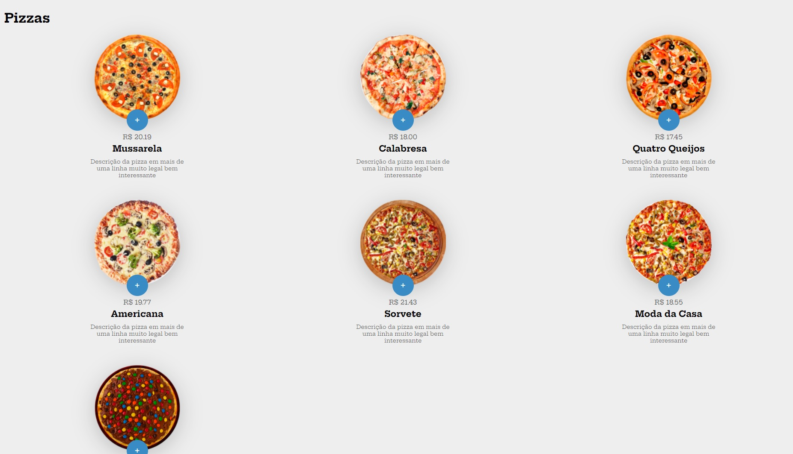
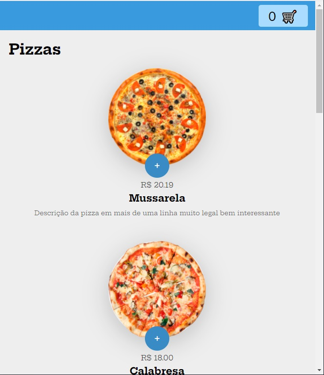
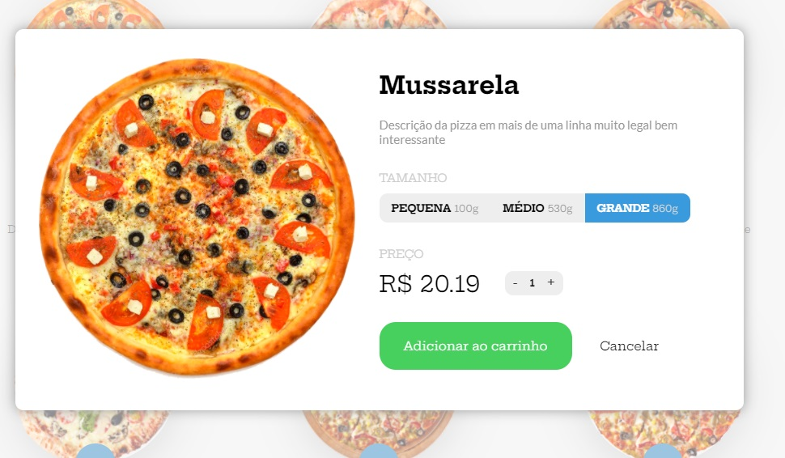
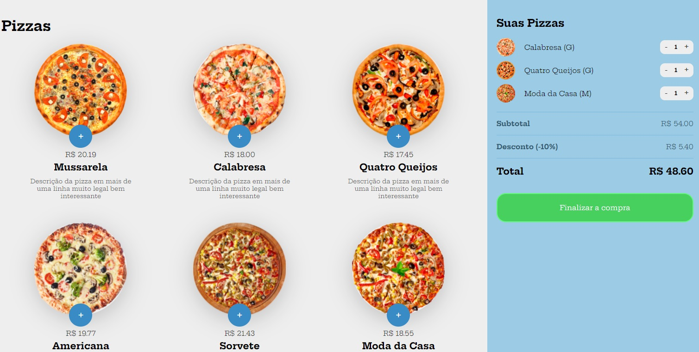
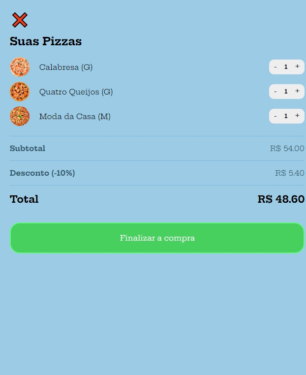

# Aplicação Web para Pizzaria :pizza:

### Tecnologias utilizadas:

* JavaScript;

* HTML5;

* CSS3;

* JSON;

* Plataforma Responsiva.

  

## Desktop (min-width 1000px):

## Mobile (max-width 1000px):

## Modal

## Carrinho de vendas

## Carrinho de vendas responsivo

